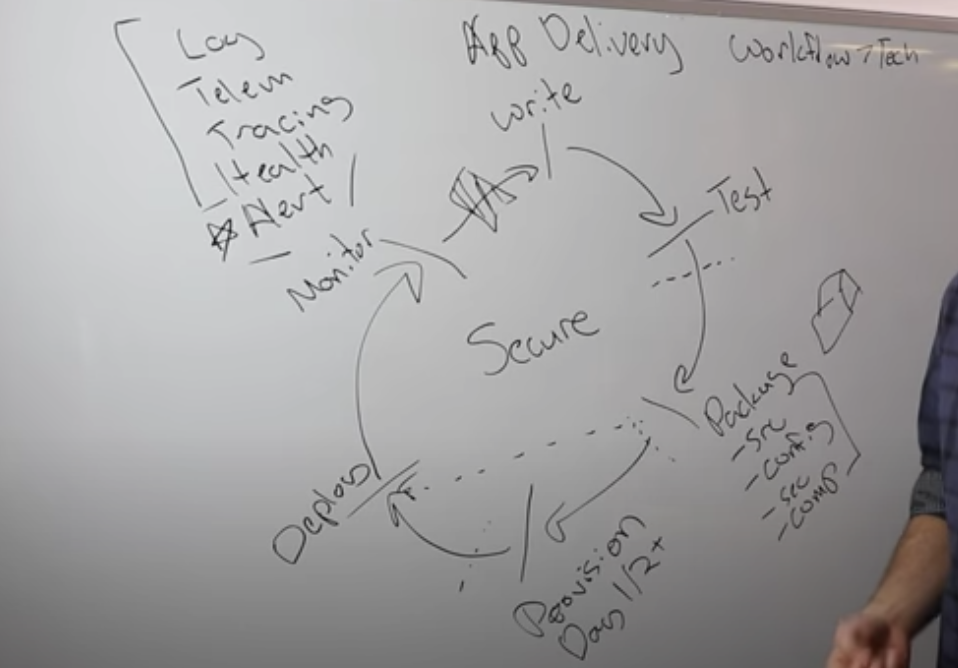

# App Delivery #

Focus on workflow orientation rather than technology.

1) Write code -> 2) Test -> 3) Packaging (config) -> 4) Provision -> 5) Deploy -> 6) Monitoring (logging, tracing, health check) -> 7) Secure

1) Vagrant -> 
2) Vagrant -> Build the development environment that looks like production
3) Packer -> Consume the code and specify the output (image, docker, vmdk)
4) Terraform -> Graph of infrastructure.
5) Nomad -> Application scheduler / coordination.
6) Consul -> Monitoring services
7) Vault -> Secrets

