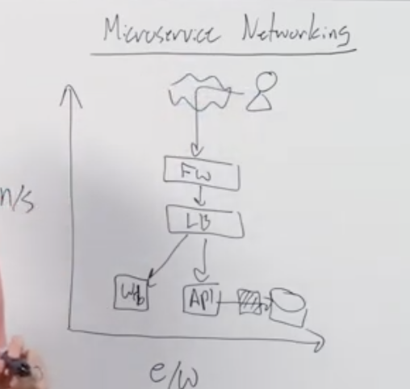

# Challenges of networking in micro services #

*North-South traffic*
Traffic between your networks and external sources

*East-West traffic*
Traffic within your own network

We need to update the networking configs many times a day.

Strains on the network in a Dynamic Infrastructure
- Service Authorizations
- Routing
- Naming

How to update Firewall / Authz, LB / Naming + traffic, API / ingress
